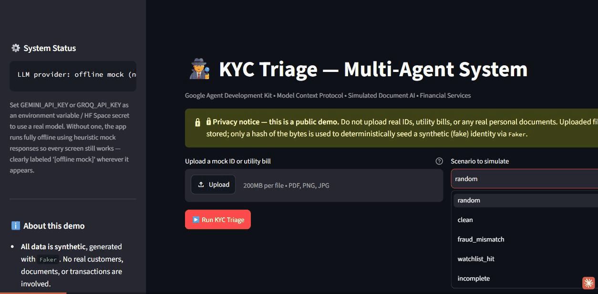

# KYC Triage Multi-Agent System

A multi-agent **KYC (Know Your Customer) triage** system for financial
services, built as an interactive portfolio piece. Three specialized
agents — Document Analysis, Fraud & Anomaly Detection, and Compliance
Verification — are coordinated by a routing orchestrator to reach an
**Approve / Reject / Manual Review** decision on a simulated applicant,
with every step logged and traceable in real time.


API calls are involved — see [what's simulated](#whats-simulated) below.



*Recorded directly from the running app — scenario selection → live multi-agent log → risk score gauge & decision dashboard. Running here in offline mock mode (no API key needed); with `GEMINI_API_KEY`/`GROQ_API_KEY` set, a real LLM powers the reasoning shown in the log.*

## Architecture

```
Upload / Generate Applicant
        │
        ▼
┌──────────────────────┐
│ Document Analysis     │  LLM agent — assesses (simulated) OCR quality,
│ Agent                 │  normalizes the applicant's name
└──────────┬────────────┘
           │ document fields
           ▼
┌──────────────────────┐
│ MCP Tool Server        │  Real Model Context Protocol server (its own
│ (subprocess)           │  process) — cross-references the document
│  • compare_identity_   │  against synthetic "on-file" history
│    fields              │
│  • check_watchlist_    │
│    and_flags           │
└──────────┬────────────┘
           │ identity comparison + watchlist result
           ▼
┌──────────────────────┐
│ Fraud & Anomaly        │  LLM agent — synthesizes tool results into a
│ Detection Agent        │  0-100 risk score + risk flags + reasoning
└──────────┬────────────┘
           │ risk score
           ▼
┌──────────────────────┐
│ Compliance Rule        │  Deterministic Python (config/rules.yaml) —
│ Engine (NOT an LLM)    │  the actual approve/reject/manual_review call
└──────────┬────────────┘
           │ verdict
           ▼
┌──────────────────────┐
│ Compliance             │  LLM agent — writes the human-readable case
│ Explanation Agent      │  file narrative (cannot change the verdict)
└──────────────────────┘
```

See [`src/orchestrator.py`](src/orchestrator.py) for why the decision
itself is made by deterministic code, not an LLM — short version: a
compliance decision needs to be auditable and reproducible, which an LLM
call inherently isn't.

## Tech stack

| Layer | Choice | Why |
|---|---|---|
| Agent framework | [Google Agent Development Kit](https://github.com/google/adk-python) | Native multi-provider LLM support, first-class tool/MCP integration |
| Tool protocol | [Model Context Protocol](https://modelcontextprotocol.io) (`mcp` SDK) | Standardized, real (not simulated) client-server tool calling |
| LLM inference | Gemini (free tier) → Groq (free tier) → offline mock, in that priority order | Zero required cost; demo never breaks without a key |
| UI | Streamlit | Fastest path to an interactive data app |
| Synthetic data | Faker | Realistic fake identities/history, zero cost, offline |
| Logging | structlog | Structured, redaction-aware, real observability |
| Governance | Plain YAML + Python (`config/rules.yaml`) | Auditable policy-as-code instead of LLM judgment |

A full beginner-friendly walkthrough of *why* each of these choices was
made, what alternatives were considered, and how the pieces fit together
is in the companion document delivered alongside this project.

## Running locally

```bash
git clone <this-repo>
cd "KYC Triage"
python -m venv .venv
.venv\Scripts\activate        # Windows
# source .venv/bin/activate   # macOS/Linux
pip install -r requirements.txt
```

Optionally copy `.env.example` to `.env` and add a free API key:

```bash
cp .env.example .env
# then edit .env and set GEMINI_API_KEY or GROQ_API_KEY
```

Then run:

```bash
streamlit run app/app.py
```

Open the URL Streamlit prints (usually `http://localhost:8501`). **No API
key is required** — without one, the app runs entirely offline using a
heuristic mock model, clearly labeled `[offline mock]` everywhere it
appears in the UI.

### Running the tests

```bash
pytest
```

39 tests cover the synthetic data generator, the guardrails module, the
MCP tools (called directly, not over the wire), the deterministic rule
engine, and full end-to-end orchestration runs for all four demo
scenarios — all of them run offline, with no API key or network access
needed.

## Deploying to Hugging Face Spaces (zero-cost)

1. Create a new Space at [huggingface.co/new-space](https://huggingface.co/new-space), choosing **Streamlit** as the SDK.
2. Hugging Face Spaces reads deployment config from a YAML block at the
   very top of the Space's `README.md`. Add this block to the top of
   **this file** before pushing to the Space (it's deliberately left out
   of the GitHub copy, since GitHub renders it as ugly literal text
   instead of parsing it):
   ```yaml
   ---
   title: KYC Triage Multi-Agent System
   emoji: 🕵️
   colorFrom: blue
   colorTo: indigo
   sdk: streamlit
   sdk_version: "1.63.0"
   app_file: app/app.py
   pinned: false
   ---
   ```
3. Push this repository to the Space's git remote (Spaces are git repos):
   ```bash
   git remote add space https://huggingface.co/spaces/<your-username>/<space-name>
   git push space main
   ```
4. (Optional) In the Space's **Settings → Variables and secrets**, add
   `GEMINI_API_KEY` or `GROQ_API_KEY` as a **Secret** (not a public
   Variable) to enable real LLM reasoning. Without one, the Space still
   works fully in offline mock mode.

That's it — no billing account, no GPU, no credit card required for
either Hugging Face Spaces itself or for the Gemini/Groq free tiers.

## Alternate deployment: containers (AWS, GCP, etc.)

The included [`Dockerfile`](Dockerfile) lets the exact same codebase run
on any container platform — useful if you want to demonstrate an AWS
deployment path specifically:

```bash
docker build -t kyc-triage .
docker run -p 8501:8501 --env-file .env kyc-triage
```

This same image deploys as-is to **AWS App Runner** (point it at an ECR
image) or **AWS ECS Fargate** (a single-container task definition) — no
code changes needed, only infrastructure configuration outside this repo.

## Honesty about what's simulated

This is a portfolio/demo project, and it's built to be upfront about
that rather than pretend otherwise:

- **No real Google Document AI calls are made anywhere.** A real
  Document AI subscription needs a billed GCP project, which would break
  the zero-cost, credential-free public demo. Uploading a file only
  hashes its bytes to deterministically seed a synthetic identity via
  `Faker` — the file's actual content is never read, stored, or sent
  anywhere. See [`src/mock_data_generator.py`](src/mock_data_generator.py).
- **All customer histories, transactions, and risk flags are synthetic**,
  generated on the fly. No real financial data of any kind is involved.
- **The LLM calls are real** (when you provide a Gemini or Groq key) —
  the simulation is limited to the *data*, not the agent reasoning.

## Project structure

```
KYC Triage/
├── app/app.py                    # Streamlit UI (no business logic)
├── src/
│   ├── mock_data_generator.py    # Faker-based synthetic identities/history
│   ├── guardrails_and_logging.py # structlog + PII redaction + validation
│   ├── llm_factory.py            # Gemini/Groq/offline-mock provider selection
│   ├── mcp_tools_server.py       # Real MCP server (fraud cross-reference tools)
│   ├── agents.py                 # 3 agent definitions + compliance rule engine
│   └── orchestrator.py           # Routes state between agents; owns the MCP session
├── config/rules.yaml             # Compliance policy-as-code
├── tests/                        # 39 tests, no API key or network required
├── requirements.txt
├── Dockerfile                    # Alternate deployment path (AWS/GCP/etc.)
├── .env.example
└── README.md
```
